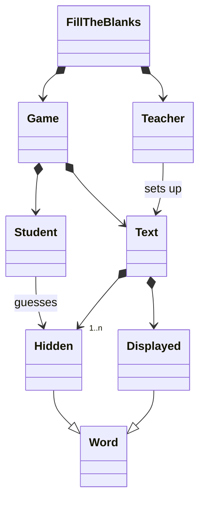

# Fill the blanks: 
- [ ] A text is displayed when the user runs the game.
- [ ] The user chooses the amount of words that will be hidden from the text (min. 1, max. all the words from the text). 
- [ ] Each blank will have an ID.
- [ ] The user must guess every blank to win the game.
- [ ] To make a guess, the user will have to specify the ID, followed by the word.
- [ ] Optional: The user determines what the displayed text will be. 

## Domain model: 


## UI prototype:
```
Welcome to Mirimiri's Fill in the blanks!

The text you are going to play with has got 69 words. How many of them would you like to guess? Enter a number between 1 and 69.

```

```
You want to guess 2 words. Fill in the blanks: 

Lorem [1] dolor sit amet, consectetur adipiscing [2], sed do eiusmod tempor incididunt ut labore et dolore magna aliqua. Ut enim ad minim veniam, quis nostrud exercitation ullamco laboris nisi ut aliquip ex ea commodo consequat. Duis aute irure dolor in reprehenderit in voluptate velit esse cillum dolore eu fugiat nulla pariatur. Excepteur sint occaecat cupidatat non proident, sunt in culpa qui officia deserunt mollit anim id est laborum.

Make a guess!

1: diem
```

```
Wrong answer! Try again: 

Lorem [1] dolor sit amet, consectetur adipiscing [2], sed do eiusmod tempor incididunt ut labore et dolore magna aliqua. Ut enim ad minim veniam, quis nostrud exercitation ullamco laboris nisi ut aliquip ex ea commodo consequat. Duis aute irure dolor in reprehenderit in voluptate velit esse cillum dolore eu fugiat nulla pariatur. Excepteur sint occaecat cupidatat non proident, sunt in culpa qui officia deserunt mollit anim id est laborum.

Make a guess!

1: ipsum
```

```
Well done! Keep it up!

Lorem [IPSUM] dolor sit amet, consectetur adipiscing [2], sed do eiusmod tempor incididunt ut labore et dolore magna aliqua. Ut enim ad minim veniam, quis nostrud exercitation ullamco laboris nisi ut aliquip ex ea commodo consequat. Duis aute irure dolor in reprehenderit in voluptate velit esse cillum dolore eu fugiat nulla pariatur. Excepteur sint occaecat cupidatat non proident, sunt in culpa qui officia deserunt mollit anim id est laborum.

Make a guess!

2: elit
```

```
Well done! You found all the words!

Lorem [IPSUM] dolor sit amet, consectetur adipiscing [ELIT], sed do eiusmod tempor incididunt ut labore et dolore magna aliqua. Ut enim ad minim veniam, quis nostrud exercitation ullamco laboris nisi ut aliquip ex ea commodo consequat. Duis aute irure dolor in reprehenderit in voluptate velit esse cillum dolore eu fugiat nulla pariatur. Excepteur sint occaecat cupidatat non proident, sunt in culpa qui officia deserunt mollit anim id est laborum.

Would you like to play again? (Y/N)
```